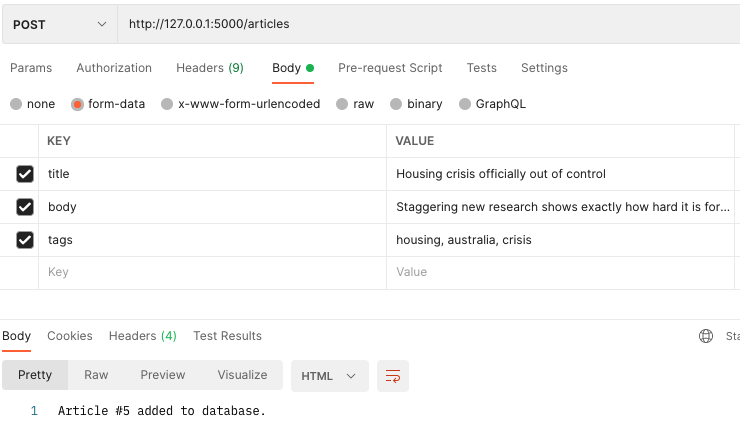
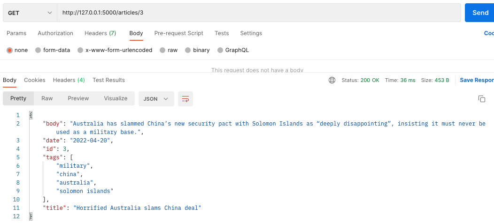
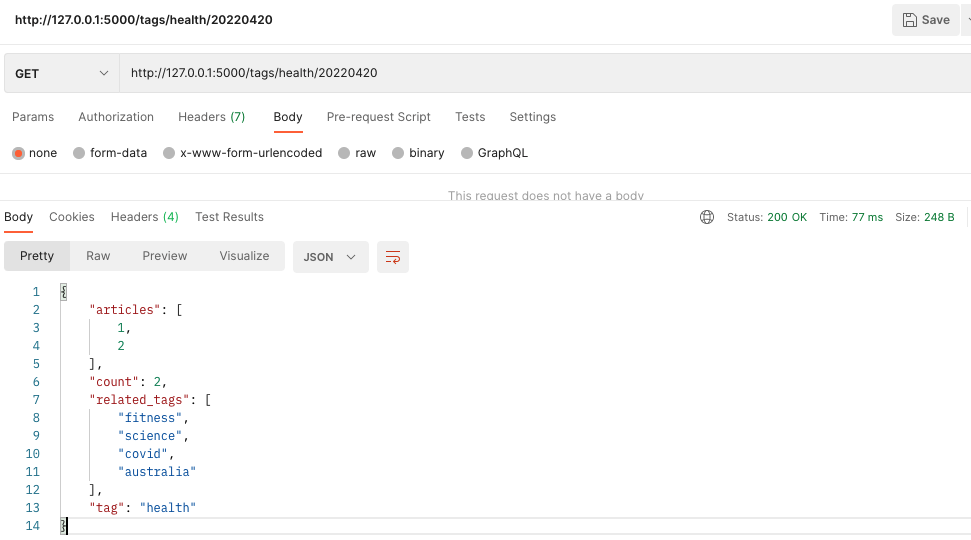
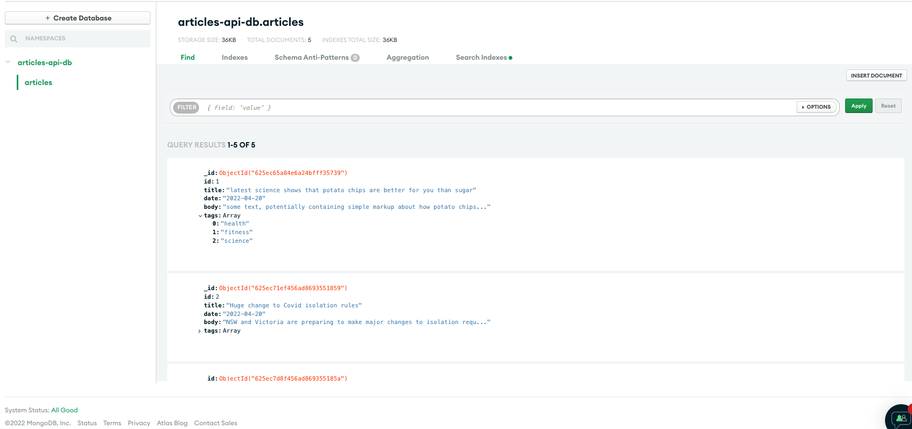

# Article API - Python

## Deliverables

### Source Code
Please see the files in this repository for source code. All of the code currently is in the ```app.py``` file. If not already installed on your machine, you may need to run ```pip3 install pymongo``` to install the PyMongo library.

### Mac Setup
In order to run this application, enter the following command into your Terminal:
```
python3 app.py
```

To run testing, enter the following command:
```
python3 testing.py
```

### Solution
Before going into coding this solution, I took some time to think about how I would be handling my data. I knew I would definitely need a database to store data in after POST requests, and to pull data after GET requests. I picked MongoDB since this is a solution I've heard about before, but never actually used. Additonally, I picked MongoDB over relational database management systems due to its support for dynamic queries, easy to use structure, and schema-less nature, which is very similar to Google Firebase's database services, which I have used in the past.

Next, I had to decide on what language to code this solution in. Originally, I wanted to use Golang since the spec said this would be favourable, however in the end I decided to build a Flask application with Python. The biggest reason I chose this was because I have experience writing back-end with Flask, and I kept getting stuck when trying to build this API in Golang.

Now, to run through my code. Knowing this was going to be a Flask application, I first built the basic structure of a Flask application with all the endpoints I was going to use (you can look through past commits to see this). From there, I used PyMongo to create a connection to the cluster I made on MongoDB. I also did a ```try/except``` to ensure that the server is available, since the MongoClient constructor returns immediately and launches the connection process on background threads.

For my POST endpoint, I first check that the user has entered a valid ```title```, ```body```, and ```tags```. This is from the ```request.form``` collection. In order to make this call, I used Postman, and entered my data in the form as you can see below:



I then selected the ```articles-api-db``` database I would be using, counted the documents in the ```articles``` collection (and incremented that) so I could determine what this new article's ```id``` would be, and split my string of ```tags``` into a list. I then used the ```insert_one()``` method to insert this new data into my ```articles``` collection. In here, I also generate the current date in the format ```YYYY-MM-DD```.

For my GET article endpoint, I did the same thing, selecting the ```articles-api-db``` database I would be using, and I initialised an empty dict ```result``` so I could return the API response in JSON format. I also counted how many documents are in the collection, so I could terminate the call if the ```id``` number exceeded this count (means the article requested doesn't exist). I then queried the collection for documents with the given ```id```, and stored it into my ```results``` dict. I also popped the ```_id``` field from this dict, as it is a standard field on MongoDB documents, and was not in the spec given to me. Then I returned the result.



For my GET tag summary endpoint, I first converted the ```date``` given to the correct ```YYYY-MM-DD``` format instead of ```YYYYMMDD```. I then selected the ```articles-api-db``` database I would be using, and queried the collection for documents with the requested ```tagName``` and ```date```. Like before, I initialised an empty dict ```objects``` so it would be easier to access the data in each document, but I also initialised empty lists for ```articles``` and ```related_tags```. I then looped over each document in the filtered collection, updating the ```objects``` dict with its data. I would then append the article ```id``` to our ```articles``` list, and looping over the tags in each document, I would append a tag to the ```related_tags``` list if it wasn't already in the list and it wasn't the same as the requested ```tagName```. If there was nothing in the ```articles``` list, this means that no articles are associated with the given tag and date, hence I terminated the call. If there are articles associated, I then created a JSON model with the information requested in the spec (with the last 10 articles), and returned this.



You can see an example of what my MongoDB collection looks like here:


### Testing
I wrote some basic unit tests in the file ```testing.py```. I tend to use this method of testing my Python code because it makes it easier to isolate small sections of my code to determine if it works as intended. These tests covered cases such as getting an article with an invalid id, and getting tag summaries on tags which don't exist, or dates with no articles. One thing I wasn't sure how to test for was my first endpoint. This is because it relies on form data from the request, and you cannot pass it in to the actual function. However, I believe I've written sufficient tests for all edge cases aside from that endpoint. This API service is also very simple, hence it doesn't require many complex tests. If I had more time, I would've written some more tests and tried to figure out how to do it for the first endpoint.

### Assumptions
One of my first assumptions for this project was regarding the payload for our first endpoint. Given the model of an article given to me, I wasn't sure whether the payload would include the ```id``` and ```date```. I decided to assume that the payload would only include the ```title```, ```body```, and ```tags```. This is because I thought of this in terms of an actual user using a form for example to submit an article. It wouldn't make sense for them to put their own ```id```, since this looked like the ```id```'s for each article will simply increment.
As a result, I simply count how many documents are in my ```articles``` collection in my database, and just add 1 to it - for example, if there were 20 documents in my collection, then the new article will have ```id = 21```. I also thought it would be easier to use the datetime library in Python to just generate the current date, as users may enter their dates in varied formats, which would make it hard to conduct queries on the database. This way, we keep a nice and consistent date format. I also assumed that the ```tags``` field would simply be entered as one long string in the format ```"tag1, tag2, ..."```. Another assumption I made was that the format of the data didn't matter - it could be letters, numbers, symbols, or all that! Hence, I just checked for if those fields were empty or non-existent.

The second endpoint seemed easy enough and straightforward and nothing had to be assumed.

For the third endpoint, I assumed that the ```count``` field simply shows the number of times the given tag is assigned to the articles for that day. The rest of this endpoint seemed straighforward to me.

### What did you think of the test and how long did it take to complete?
I think this was a great test. It was a fun challenge that gave me freedom to experiment with my assumptions and methods of doing things. This took me about 6 hours worth of coding and debugging to finish. I was slowed down by trying to figure out how MongoDB works, however I also spent at least a day trying to implement this in Golang and doing research on MongoDB.

### What else you would have added to the code if you had more time?
If I had more time, I would've definitely given it a crack in Golang. I also would have tried to simplify my third endpoint a lot more and make this solution a bit more "production ready". I also would have done more to handle my PyMongo errors, and wrote more substantial tests, but I ran out of time.
